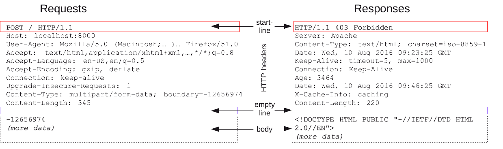

# HTTP

- Hypertext Transfer Protocol is designed to enable communication between clients and services.  

- A client sends an HTTP reuest to the server, the the server returns a reponse to the client.  

## HTTP messages 
1. A start line describing the requests to be implemented, or its status
2. An optional set of HTTP headers specifying the request or describing the body included in the message.  
3. A blank line indicating all meta-information for the request has been sent.  
4. An optional body containing data associated with the request.  

## HTTP methodes 

### The GET Method 

- GET is used to request data from a  specified resoure, it means source should be fetched. 

`/test/demo_form.php?name1=value1&name2=value2`

- This URL requests the server to execute `demo_form.php` script with specific paramters (`name1` and `name2`).  

### The POST Method 

- POST is used to send data to a server to create/update a resource, it means that data is pushed to the server.  

`POST /test/demo_form.php HTTP/1.1
Host: w3schools.com

name1=value1&name2=value2 `

this POST request is directed to w3schools.com to submit data (name1=value1 and name2=value2) to the /test/demo_form.php script on the server.